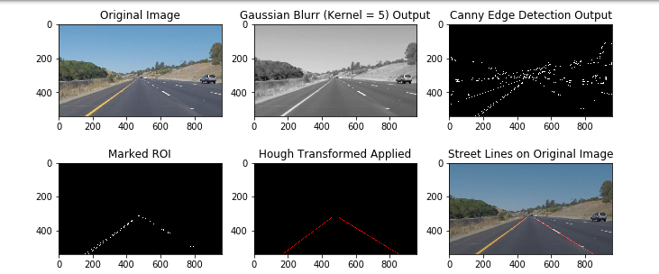
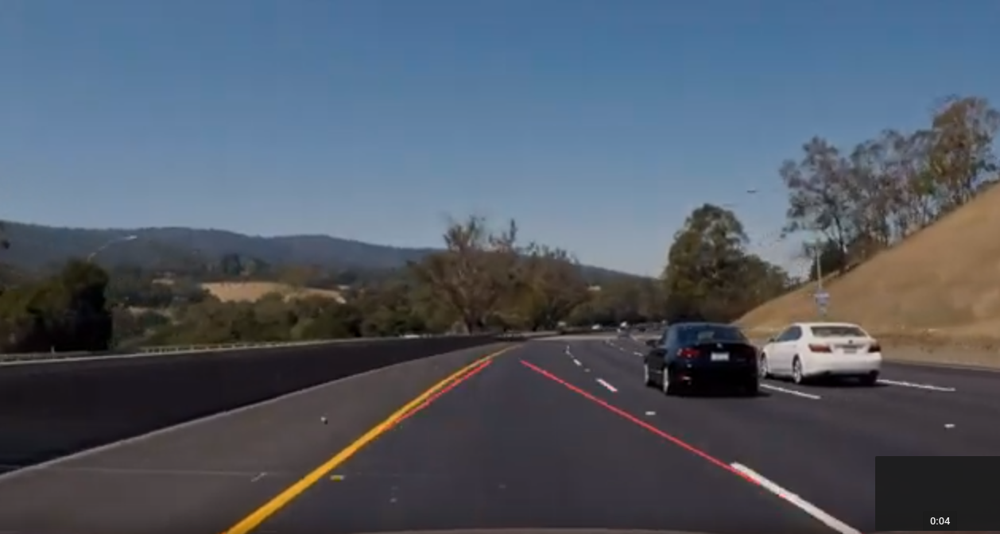

## Reflection

### 1. Describe your pipeline. As part of the description, explain how you modified the draw_lines() function.
A. My pipeline consisted of 5 steps. First, I converted the images to grayscale. Second, I
implemented gaussian blur to remove noise and irrelevant details from the image. Third, canny
edge detection was implemented to help make the main lane lines stand out.As recommended to
incorporate 2:1 or 3:1 ratio of thresholds, I set low and high threshold to 50 and 50 respectively.
Fourth, I implemented a polygon mask to obtain lane lines only. Fifth, hough transform was
implemented thereby extracting all the lines passing through edge points.

In order to draw a single line on the left and right lanes, I modified the draw_lines() function by
looking for slopes of the lines and classifying them into left (-) and right (+) lane lines. Mean of
the slopes and intercept formula was used to calculate min and max values along the y-axis
(precomputed x-axis). Than cv2.line function was used to draw lines between the min and max
coordinates. Figure 1 displays the output from the pipeline. The implemented code is in
findingLaneLinesonTheRoad.ipynb file.

Following are the results of the code on **test videos** 

|Solid White Right|
|:------------:|
| |
|[Youtube Link](https://youtu.be/1WB2iHLmNtk)|

|Solid White Right|
|:------------:|
||
|[Youtube Link](https://youtu.be/LmwmfHH3Ma8)|

|Challenge video|
|:------------:|
|[]|
|[Youtube Link](https://youtu.be/Nsn99yFMSAk)|

### 2. Identify potential shortcomings with your current pipeline.
The pipeline yields poor results on curved lane lines and will not be robust to different lighting
conditions.

### 3. Suggest possible improvements to your pipeline.
Instead of fitting a line, a function that is apt for curve detection needs to be implemented.
