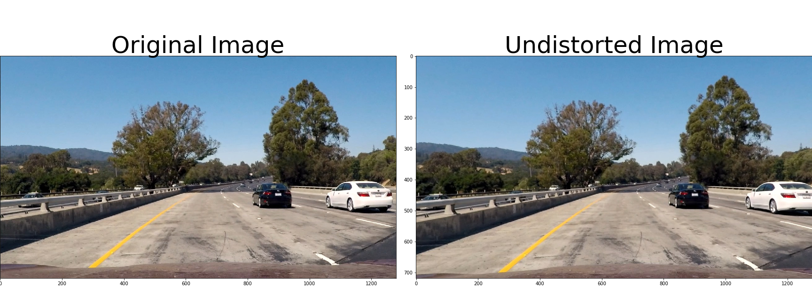

**Advanced Lane Finding Project**

The goals / steps of this project are the following:

* Compute the camera calibration matrix and distortion coefficients given a set of chessboard images.
* Apply a distortion correction to raw images.
* Use color transforms, gradients, etc., to create a thresholded binary image.
* Apply a perspective transform to rectify binary image ("birds-eye view").
* Detect lane pixels and fit to find the lane boundary.
* Determine the curvature of the lane and vehicle position with respect to center.
* Warp the detected lane boundaries back onto the original image.
* Output visual display of the lane boundaries and numerical estimation of lane curvature and vehicle position.

### Camera Calibration

#### 1. Briefly state how you computed the camera matrix and distortion coefficients. Provide an example of a distortion corrected calibration image.

The code for this exercise is contained in the first code cell of the IPython notebook located in `examples/advancedLaneFinding.ipynb`.  

I start by preparing "object points", which will be the (x, y, z) coordinates of the chessboard corners in the world. Here I am assuming the chessboard is fixed on the (x, y) plane at z=0, such that the object points are the same for each calibration image.  Thus, `objp` is just a replicated array of coordinates, and `objpoints` will be appended with a copy of it every time I successfully detect all chessboard corners in a test image.  `imgpoints` will be appended with the (x, y) pixel position of each of the corners in the image plane with each successful chessboard detection.  

I then used the output `objpoints` and `imgpoints` to compute the camera calibration and distortion coefficients using the `cv2.calibrateCamera()` function.  I applied this distortion correction to the test image using the `cv2.undistort()` function.

### Pipeline (single images)

#### 1. Provide an example of a distortion-corrected image.

To demonstrate this step, I will describe how I apply the distortion correction to one of the test images like this one:

The correct application of distortion correction can be verified by comparing hood of the car in original and undistorted image.

#### 2. Describe how (and identify where in your code) you used color transforms, gradients or other methods to create a thresholded binary image.  Provide an example of a binary image result.
I implemented gradient thresholding via sobel in x-direction, magnitude and direction of gradient which were able to fairly detect lane lines. Incase of lanes lines having shadow on it, gradient threshold was failing. Therefore I implemented color thresholding using saturation parameter in the HLS space as S channel is efficient in detecting yellow and white lanes.

The code for this implementation is in cell 5 and 6 of the submitted code.

#### 3. Describe how (and identify where in your code) you performed a perspective transform and provide an example of a transformed image.
After manually examining the image, I extracted vertices to perform perspective transform. I verified that my perspective transform was working as expected by drawing the `src` and `dst` points onto a test image and its warped counterpart to verify that the lines appear parallel in the warped image. Following is an output of the undistorted threshold warped image:

The code for this implementation is in cell 8,9 and 10 of the submitted code.

#### 4. Describe how (and identify where in your code) you identified lane-line pixels and fit their positions with a polynomial?
After applying calibration, thresholding and perspective transform we have an binary image where the lane lines stand out clearly. To determine which pixels are part of the lines as well as to determine if the belong to right or left lines.
I first take a histogram along all columns in lower half of image. The prominenet peaks in this histogram will be good indicators of base position of lane lines. After which sliding window is placed around line centers to track the lines to the top of the frame. Following image is an implementation of this step:

As per the course notes I have implemented a function which searches around previously detected lane lines since consecutive frames are suppose to have lane lines in fairly similar positions. The output image for this implementation is as flows

The code for this implementation is in cells 11-15 of the submitted code.

#### 5. Describe how (and identify where in your code) you calculated the radius of curvature of the lane and the position of the vehicle with respect to center.

I did this in cells 16 and 17 of my submitted code. The radius of curvature is computed according to the formula and method described in course notes. Since we perform the polynomial fit in pixels and whereas the curvature has to be calculated in real world meters, we have to use a pixel to meter transformation and recompute the fit again.The mean of the lane pixels closest to the car gives us the center of the lane. The center of the image gives us the position of the car. The difference between the 2 is the offset from the center.

#### 6. Provide an example image of your result plotted back down onto the road such that the lane area is identified clearly.

In step 18 I implemented inverse perspective transform and the result is following image:  

---

### Pipeline (video)

#### 1. Provide a link to your final video output.  Your pipeline should perform reasonably well on the entire project video (wobbly lines are ok but no catastrophic failures that would cause the car to drive off the road!).

Here's a link to my video result:

|Test video|
|:------------:|
| |
|[Youtube Link](https://youtu.be/Y02nLcZSTIw)|

Output on challenge videos:

|Challenge video 1|Challenge video 2|
|:------------:|:------------:|
|[Youtube Link](https://youtu.be/QIAwOpBLncw)|[Youtube Link](https://youtu.be/2wy2M3qYtlI)|

---

### Discussion

#### 1. Briefly discuss any problems / issues you faced in your implementation of this project.  Where will your pipeline likely fail?  What could you do to make it more robust?

I spent a lot of time implementing gradient and color channel threshold. However the results are still not optimal in case of different lighting conditions and sharp curves. And I am not quite sure about the implemented centre of car parameter.  
