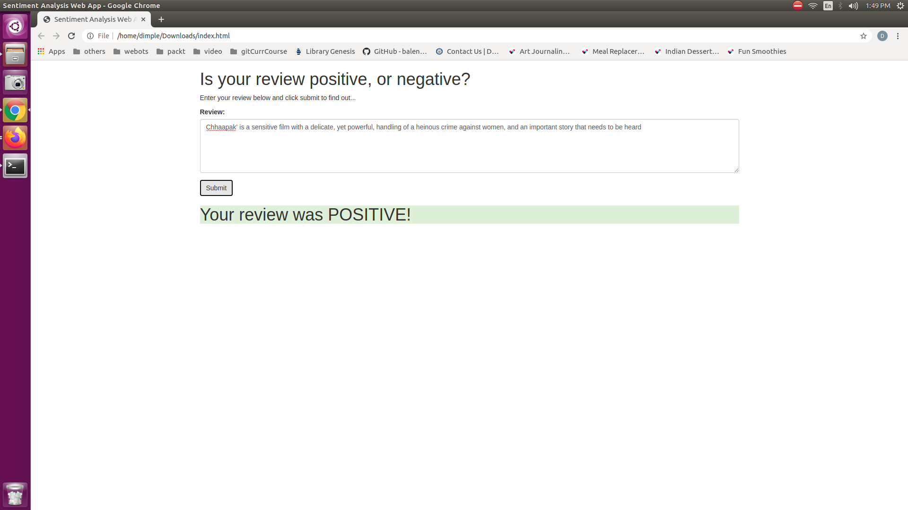
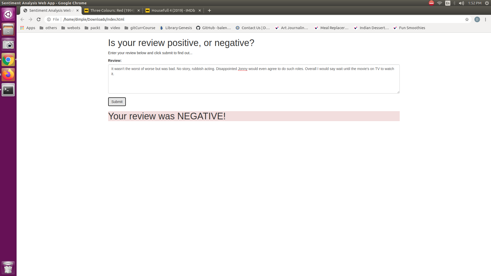

### Output
Following is the output to the reviews from deployed sentiment analysis model  

Also, as mentioned in the lectures I have deleted the endpoint, lambda function and API Gateway after sucessful execution.

### Notes
Follow this steps to increase limit for the p2.xlarge instance  
https://udacity.zendesk.com/hc/en-us/articles/360037696812-How-do-I-request-a-limit-increase-for-my-p2-xlarge-instance-  
It takes about 24-48 hours to receive response  
Also make sure you select the correct region in your AWS console

